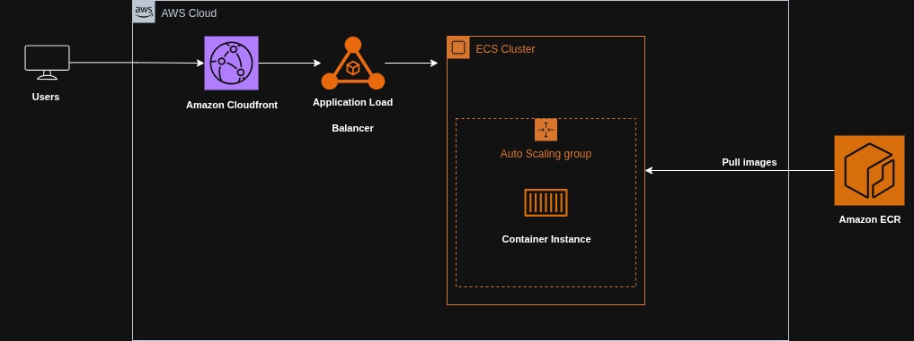

# 🐍 Python App on AWS ECS with Terraform & CI/CD

This project provisions a containerized **Python application** on **AWS ECS** using **Terraform** and deploys it via **GitHub Actions CI/CD**.
The application retrieves the EC2 instance metadata (public/private IP) and exposes it through a simple HTTP server with a custom health check.

The solution demonstrates **containerization, orchestration, automated deployments, security scanning, and infrastructure as code**.

---

## 📐 Architecture

- **Python App**
  - Fetches and displays EC2 instance metadata (IP address)
  - Includes a custom health check endpoint
  - Containerized with Docker

- **AWS Infrastructure**
  - **ECR**: Stores Docker images
  - **ECS Cluster & Service**: Runs the containerized app
  - **Task Definition**: Defines app runtime and container details
  - **ALB (Application Load Balancer)**: Routes traffic to ECS tasks with HTTPS listener and ACM certificate
  - **CloudFront Distribution**: Provides global caching and HTTPS termination for clients
  - **ACM Certificates**: TLS for both CloudFront and ALB
  - **Route53**: Custom DNS record pointing to CloudFront

---

### 🔒 TLS / HTTPS Flow

1. Clients connect to **CloudFront** over HTTPS
2. **CloudFront terminates TLS** for the client, then forwards requests to the **ALB over HTTPS**
3. **ALB terminates TLS** with its ACM certificate and forwards traffic to ECS tasks

👉 This setup provides **end-to-end encryption**, ensuring secure communication from clients all the way to the ECS tasks.

---

## 🛠️ Tech Stack

- **Application**
  - Python
  - Custom health check
  - Docker

- **AWS Services**
  - ECS, ECR, ALB, CloudFront, Route53, ACM

- **Infrastructure**
  - Terraform (modules, ECS, ALB, networking, CloudFront, Route53, ACM)

- **CI/CD**
  - GitHub Actions with two pipelines:
    1. **Terraform infra deployment** (`infra/`)
       - Linting (Terraform fmt, TFLint)
       - Vulnerability scanning (Trivy)
       - Provisioning ECS, ECR, ALB, Route53, CloudFront
    2. **App deployment** (`app/`)
       - Build & lint Docker image (Hadolint)
       - Vulnerability scanning (Trivy)
       - Push image to ECR
       - Update ECS Task Definition & Service
       - Invalidate CloudFront cache

